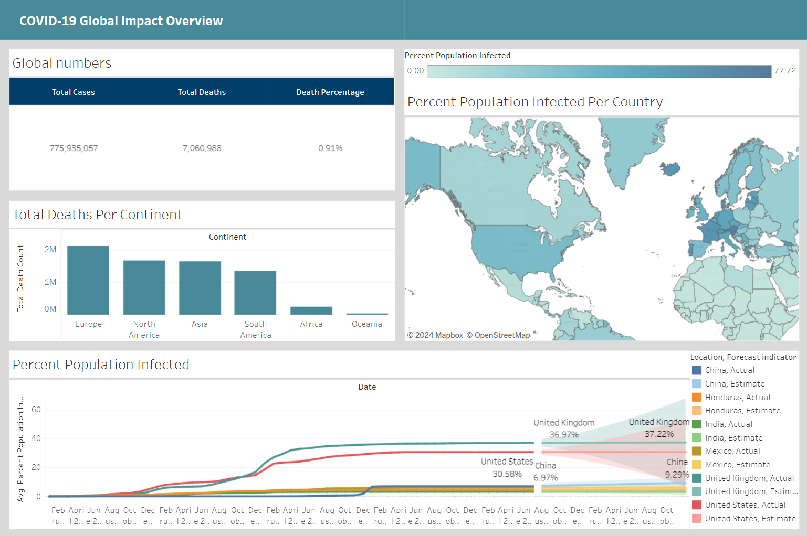

# Project: COVID-19 Global Impact Overview

**Description**: This project analyzes the global impact of the COVID-19 pandemic using data on reported deaths and cases from various sources. The objective is to provide a clear and concise view of how the pandemic has affected different regions of the world, focusing on mortality rates, the spread of infections, and future trends.

**Dataset**:

- **Source**: [Coronavirus (COVID-19) Deaths](https://ourworldindata.org/covid-deaths) from Our World in Data. This dataset provides up-to-date information on the number of confirmed COVID-19 deaths and cases by country and region.

**Key questions addressed by the analysis**:

1. **What is the percentage of COVID-19 deaths relative to total cases?**

   - Provides a metric of the virus's lethality across different countries and regions.

2. **What is the total number of deaths by continent?**

   - Analyzes the geographic distribution of deaths to understand which continents have been most impacted.

3. **What percentage of the population has been infected by country?**

   - Measures the proportion of the population that has been infected relative to each country's total population, offering insight into the pandemic's reach in each region.

4. **What are the infection estimates for the coming months by country?**
   - Predicts the future growth of cases based on current trends and projections, providing key information for planning and response.

**Tools and Techniques**:

- **Descriptive Analysis**: To understand the distribution and rates of infection and mortality.
- **Predictive Modeling**: Using mathematical models to estimate future infection trends.
- **Data Visualization**: Creating interactive charts and maps to facilitate data interpretation.
  """

## Analysis Procedure:

1. **Data Download**: The dataset was first downloaded as a CSV file from the source.
2. **Data Load into SQL Server**: The CSV file was then uploaded to Microsoft SQL Server for data management.
3. **SQL Queries**: Necessary data was extracted using SQL queries to retrieve specific insights.
4. **Export to Excel**: The result of each query was exported as a separate Excel file.
5. **Data Source Addition**: Each Excel file was added as a separate data source for further analysis.

## Dashboard:

The dashboard includes four visualizations:

1. **Cases and Deaths Summary Table**: This table displays the total number of COVID-19 cases, the total number of deaths, and the percentage of deaths relative to the number of cases.
2. **Deaths by Continent Bar Chart**: A bar chart that compares the number of deaths across different continents.
3. **Infection Percentage by Country Map**: A map showing the percentage of the population infected by COVID-19 for each country.
4. **Infection Over Time Line Chart**: A line chart that tracks the percentage of the population infected by COVID-19 in each country over time.
   
