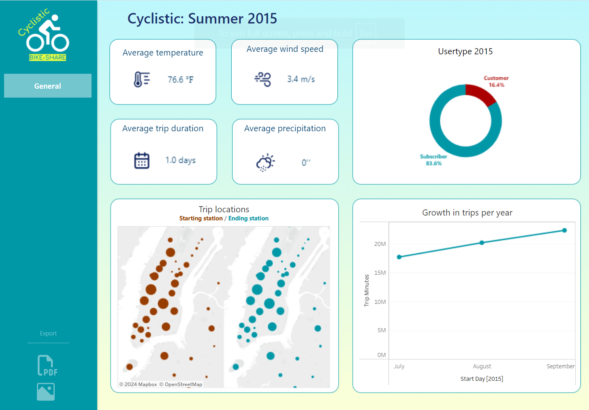

# Cyclistic’s End-of-Course Project


## Cyclistic’s End-of-Course Project Overview:

Cyclistic, in partnership with the City of New York, operates a bike-sharing program with stations throughout Manhattan and neighboring boroughs. Customers can easily rent bikes to travel between these stations, making urban transportation more convenient.

The Cyclistic Customer Growth Team is preparing a business plan for the upcoming year, aiming to understand customer usage patterns to optimize service offerings. A key focus is identifying customer demand across different station locations.

You can view the dashboard with insights from this project on [Tableau Public](https://public.tableau.com/views/Cyclistic_17243065915040/Cyclistic2015?:language=en-US&:sid=&:redirect=auth&:display_count=n&:origin=viz_share_link).

To achieve this, Cyclistic has recorded detailed data on every trip taken, including:

- Trip start time and location: Capturing the station number and its latitude/longitude.
- Trip end time and location: Capturing the station number and its latitude/longitude.
- Bike identification number: Unique identifier for each rented bike.
- Customer type: Indicating whether the customer is a one-time user or a subscriber.

The dashboard include:

- **Station Usage Visualization:** A table or map showing aggregated start and end station locations.
- **Popular Destinations:** A visualization highlighting top destination locations based on total trip duration.
- **Summer 2015 Trends:** A specific focus on data trends from the summer of 2015.
- **Year-Over-Year Growth:** A visualization of the percentage growth in the number of trips year over year.
- **Station Congestion Insights:** Analysis of station congestion patterns.
- **Trip Volume Insights:** Data on the number of trips across all start and end locations.
- **Peak Usage Analysis:** Insights into peak usage times, seasonal trends, and weather impacts.

## Datasets

For this end-of-course project, I used the following public datasets, available in the Google Cloud Platform:

- [NYC Citi Bike Trips](https://console.cloud.google.com/marketplace/details/city-of-new-york/nyc-citi-bike)
- [Census Bureau US Boundaries](https://console.cloud.google.com/marketplace/product/united-states-census-bureau/us-geographic-boundaries)
- [GSOD from the National Oceanic and Atmospheric Administration](https://console.cloud.google.com/marketplace/details/noaa-public/gsod)
- [NYC Zip Code Spreadsheet](https://docs.google.com/spreadsheets/d/1IIbH-GM3tdmM5tl56PHhqI7xxCzqaBCU0ylItxk_sy0/template/preview#gid=806359255)

These datasets were uploaded to Google BigQuery to create two target tables: one for general information and another focused on the summer of 2015. Once these tables were generated, they were downloaded as CSV files and imported into Tableau for further analysis and visualization.

### Target Table 1: General Information

This query aggregates key trip information, combining it with weather data and zip code information to provide a comprehensive view of the trips:

```sql
SELECT
  TRI.usertype,
  ZIPSTART.zip_code AS zip_code_start,
  ZIPSTARTNAME.borough AS borough_start,
  ZIPSTARTNAME.neighborhood AS neighborhood_start,
  ZIPEND.zip_code AS zip_code_end,
  ZIPENDNAME.borough AS borough_end,
  ZIPENDNAME.neighborhood AS neighborhood_end,
  DATE_ADD(DATE(TRI.starttime), INTERVAL 5 YEAR) AS start_day,
  DATE_ADD(DATE(TRI.stoptime), INTERVAL 5 YEAR) AS stop_day,
  WEA.temp AS day_mean_temperature,  -- Mean temperature
  WEA.wdsp AS day_mean_wind_speed,   -- Mean wind speed
  WEA.prcp AS day_total_precipitation,  -- Total precipitation
  ROUND(CAST(TRI.tripduration / 60 AS INT64), -1) AS trip_minutes,  -- Group trips into 10-minute intervals
  COUNT(TRI.bikeid) AS trip_count
FROM
  `bigquery-public-data.new_york_citibike.citibike_trips` AS TRI
INNER JOIN
  `bigquery-public-data.geo_us_boundaries.zip_codes` AS ZIPSTART
ON ST_WITHIN(
  ST_GEOGPOINT(TRI.start_station_longitude, TRI.start_station_latitude),
  ZIPSTART.zip_code_geom)
INNER JOIN
  `bigquery-public-data.geo_us_boundaries.zip_codes` AS ZIPEND
ON ST_WITHIN(
  ST_GEOGPOINT(TRI.end_station_longitude, TRI.end_station_latitude),
  ZIPEND.zip_code_geom)
INNER JOIN
  `bigquery-public-data.noaa_gsod.gsod20*` AS WEA
ON PARSE_DATE("%Y%m%d", CONCAT(WEA.year, WEA.mo, WEA.da)) = DATE(TRI.starttime)
INNER JOIN
  `bi-course-429916.cyclistic_dataset.NYC-ZIP-CODES` AS ZIPSTARTNAME
ON ZIPSTART.zip_code = CAST(ZIPSTARTNAME.zip AS STRING)
INNER JOIN
  `bi-course-429916.cyclistic_dataset.NYC-ZIP-CODES` AS ZIPENDNAME
ON ZIPEND.zip_code = CAST(ZIPENDNAME.zip AS STRING)
WHERE
  WEA.wban = '94728'  -- NEW YORK CENTRAL PARK
  AND EXTRACT(YEAR FROM DATE(TRI.starttime)) BETWEEN 2014 AND 2015
GROUP BY
  1, 2, 3, 4, 5, 6, 7, 8, 9, 10, 11, 12, 13
```

### Target Table 2: Summer 2015

This query focuses on trips taken during the summer of 2015, with unmodified start and end dates, to provide detailed insights into seasonal trends:

```sql
SELECT
  TRI.usertype,
  TRI.start_station_longitude,
  TRI.start_station_latitude,
  TRI.end_station_longitude,
  TRI.end_station_latitude,
  ZIPSTART.zip_code AS zip_code_start,
  ZIPSTARTNAME.borough AS borough_start,
  ZIPSTARTNAME.neighborhood AS neighborhood_start,
  ZIPEND.zip_code AS zip_code_end,
  ZIPENDNAME.borough AS borough_end,
  ZIPENDNAME.neighborhood AS neighborhood_end,
  DATE(TRI.starttime) AS start_day,  -- Start date unmodified
  DATE(TRI.stoptime) AS stop_day,    -- End date unmodified
  WEA.temp AS day_mean_temperature,  -- Daily mean temperature
  WEA.wdsp AS day_mean_wind_speed,   -- Daily mean wind speed
  WEA.prcp AS day_total_precipitation, -- Daily total precipitation
  ROUND(CAST(TRI.tripduration / 60 AS INT64), -1) AS trip_minutes, -- Trip duration in minutes, rounded to 10
  TRI.bikeid
FROM
  `bigquery-public-data.new_york_citibike.citibike_trips` AS TRI
INNER JOIN
  `bigquery-public-data.geo_us_boundaries.zip_codes` AS ZIPSTART
ON ST_WITHIN(
  ST_GEOGPOINT(TRI.start_station_longitude, TRI.start_station_latitude),
  ZIPSTART.zip_code_geom)
INNER JOIN
  `bigquery-public-data.geo_us_boundaries.zip_codes` AS ZIPEND
ON ST_WITHIN(
  ST_GEOGPOINT(TRI.end_station_longitude, TRI.end_station_latitude),
  ZIPEND.zip_code_geom)
INNER JOIN
  `bigquery-public-data.noaa_gsod.gsod20*` AS WEA
ON PARSE_DATE("%Y%m%d", CONCAT(WEA.year, WEA.mo, WEA.da)) = DATE(TRI.starttime)
INNER JOIN
  `bi-course-429916.cyclistic_dataset.NYC-ZIP-CODES` AS ZIPSTARTNAME
ON ZIPSTART.zip_code = CAST(ZIPSTARTNAME.zip AS STRING)
INNER JOIN
  `bi-course-429916.cyclistic_dataset.NYC-ZIP-CODES` AS ZIPENDNAME
ON ZIPEND.zip_code = CAST(ZIPENDNAME.zip AS STRING)
WHERE
  WEA.wban = '94728'  -- Filtered by Central Park weather station
  AND DATE(TRI.starttime) BETWEEN DATE('2015-07-01') AND DATE('2015-09-30')  -- Filter by summer 2015

```

### Dashboard 1: Usage Insights & Demand Trends

This dashboard provides a comprehensive overview of how Cyclistic's bike-sharing service is utilized across New York City. It is designed to help decision-makers understand key usage patterns and demand trends across various locations.

Visualizations:

1. Average Temperature: Displays the average daily temperature during trips, providing insight into how weather impacts bike usage.

2. Average Wind Speed: Shows the average wind speed, helping to understand its influence on the comfort and safety of bike trips.

3. Average Precipitation: Illustrates the average precipitation levels, which could affect customer willingness to ride.

4. Average Trip Duration: Highlights the average duration of trips, offering a sense of how long users typically ride.

5. Growth in Trips Per Year: A bar chart showing the year-over-year growth in the number of trips, indicating trends in user adoption and service popularity.

6. Trip Locations Map: A geographical representation of starting and ending stations, overlaid with the number of trips and neighborhood information, to identify areas of high demand.

7. User Type Distribution: A donut chart showing the percentage and number of trips made by one-time customers versus subscribers, revealing the customer base composition.

8. Station Congestion Heatmap: A heatmap visualizing the number of trips between each starting and ending station, helping identify congestion points and popular routes.

9. Popular Destinations Bar Chart: A bar chart highlighting the top 5 most popular destination stations, providing insight into preferred locations.


## Dashboard 2: Summer 2015 Analysis

This dashboard focuses on the specific usage patterns and trends observed during the summer of 2015. The purpose is to provide a seasonal snapshot of customer behavior during peak usage periods.
​
Visualizations:
​

1. Average Temperature: Displays the average temperature during the summer of 2015, offering context for seasonal variations in bike usage.
   ​
2. Average Wind Speed: Shows the average wind speed during this period, giving further weather-related insights.
   ​
3. Average Precipitation: Illustrates the average daily precipitation, helping understand how weather conditions impacted bike usage during the summer.
   ​
4. Average Trip Duration: Highlights the average trip duration, with a focus on how summer conditions may influence ride times.
   ​
5. User Type Distribution: A donut chart representing the percentage and number of trips by one-time customers and subscribers during the summer of 2015.
   ​
6. Trip Locations Map: A map showing starting and ending stations during the summer, including trip counts and neighborhood details, to visualize high-demand areas during this peak season.
   ​
7. Growth in Trips: A bar chart focusing on the growth in trips during the summer months, comparing it year over year to identify any significant increases or decreases in usage.
   
